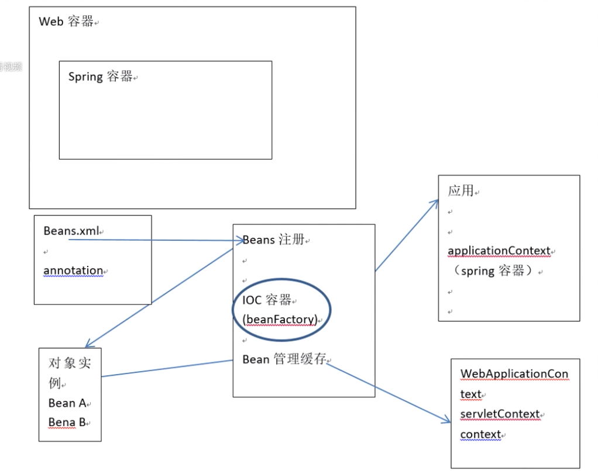

# 嵌入式服务器
1. 安装Java
2. 安装Web或者是应用程序的服务器(Tomcat/Wbesphere/Weblogic)
3. 部署应用程序War包

嵌入式服务器就是我们的可执行单元包含服务器的二进制文件(如：tomcat.jar)
对于一个Spring Boot应用程序来说，你可以生成一个包含Embedded Tomcat的应用程序jar。
你就像运行正常Java应用程序一样来运行Web应用程序了。

# 自动配置

1. 任何一个应用主要是由多个对象互相之间的特定关系来完成特定的任务
2. Spring容器 -> 创建一个物理空间，在里面放入一些对象，描述对象和对象间的关系
3. 把容器中一些具象的东西交给context管理

# 自动配置的实现原理
**导入一系列自动配置类，实现强大的自动配置功能**
1. SpringBoot 在启动时扫描项目所依赖的jar包，寻找包含spring.factories文件的jar
2. 根据spring.factories配置加载AutoConfigure类
3. 根据`@Conditional`注解的条件，进行自动配置并将Bean(对象)注入Spring Context

# SpringBoot 项目结构分层
1. 界面层 (Controller) - 接收用户请求，返回数据给用户
2. 业务访问层 (Service) - 针对具体问题(数据访问层)进行操作，对业务进行处理 (构建积木)
3. 数据访问层 (Repository) - 对数据库的数据表进行增删改查操作 (积木)
4. 模型层 (Model)

## Spring 中定义Bean:
* `@Controller`
* `@Service`
* `@Repository`
* `Component`
* `Entity`

## Spring 中得到Bean：
* `Autowire`
* `Resource`
* `Qualifer`